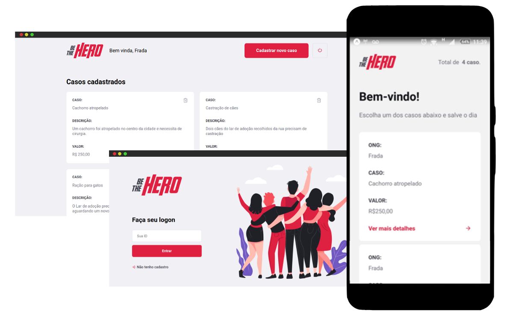

<h1 align="center">
    
</h1>

<h3 align="center">
  Projeto desenvolvido na semana omnistack 11 provida pela <a href="https://rocketseat.com.br/">Rocketseat</a>
</h3>

---

## Sobre o projeto

Este projeto foi desenvolvido no período de uma semana durante o evento *semana omnistack 11*. Neste evento usamos uma única linguagem de programação, o Javascript, para desenvolve o backend, frontend e o mobile do projeto além de rotinas de testes automatizados.

O projeto **Be The Hero** é uma plataforma para que ong's sem fins lucrativos possam relatar casos de ações que precisam de financiamento para serem executados, esses relatos ocorrem por meio de uma plataforma Web e são consultados por meio do App de celular pela comunidade, que pode visualizar os casos relatados e escolher um ou mais casos para financiar, por meio do App a comunidade pode entrar em contato sendo direcionado para o whatsapp ou email da ong escolhida.

    

## Get Started

O processo de inicialização deste projeto é muito simples, estes requerem o node e o npm para serem executados.

1. Clone do repositório para seu workspace
2. Executando o Backend
  - Abra o diretório backend e execute o comando `npm start`
3. Executando o Frontend
  - Abra o diretório frontend e execute `npm start`
4. Executando o mobile
  - Abra o diretório mobile e execute `npm start`
  - Na tela do browser que for apresentada, copie o endereço ip (sem a porta) apresentado no canto inferior esquerdo da tela
  - Abra o arquivo [api.js](./mobile/services/api.js)
  - Edite o endereço ip do parâmetro `baseURL` copiado anteriormente
  - No terminal usado para inicializar o mobile presione Ctrl+C para parar o servidor
  - Execute novamente `npm start`
  - Baixe o aplicativo Expo em seu smartphone
  - Use o leitor de código de barras do aplicativo para ler o código apresentado no browser (seu computador e seu smartphone precisam estar na mesma rede)

### Testando as rotas

O backend desta aplicação é uma API REST, as rotas existentes foram testadas durante o seu desenvolvimento com o aplicativo Insomnia, você pode baixar o json de teste clicando no botão abaixo.

## Seja um herói de verdade

Faça o fork deste projeto e edite livremente, publique este serviço e ajude ongs de verdade!

## Licença

Esse projeto está sob a licença MIT. Veja o arquivo [LICENSE](LICENSE) para mais detalhes.

---

by Mauricio Redmerski André
